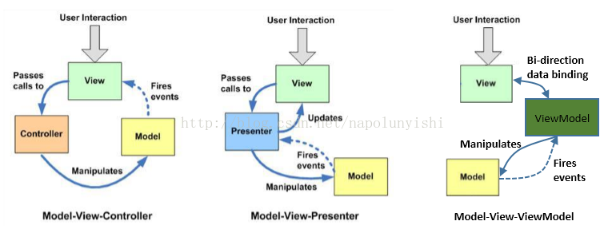
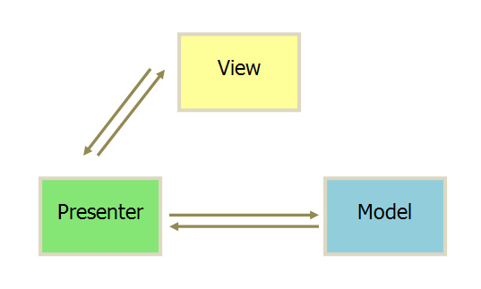
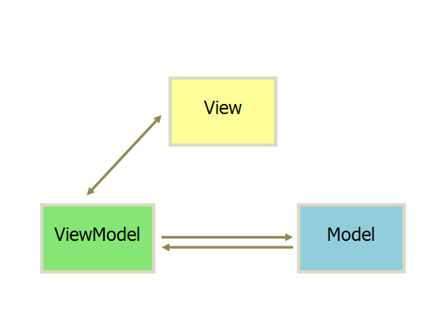

## MVC

**Model**: Manages data for an application. When a model changes(when it is updated), it will notify its observers(e.g views)

**View**: Visual representation

**Controller**: Controller listens the events of the view and manipulates model. Model updates view. It is in a single direction.

There are generally 2 kinds of MVC pattern. One is view listening user's interaction, one is controller listening

```
view -> controller -> model -
  ^                          |
  |                          |
   --------------------------
```




## MVP
The change of `mode` would be catched by the `presenter`, and `presenter` updates the `view`.


## MVVM

The only difference between MVP and MVVM is that `MVVM` is using two-wat data binding: the change of view will directly reflect on the viewModel and vice versa.



UI领域大致分化为：界面， 数据，事件，业务
